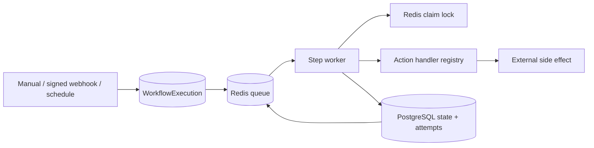

# Architecture

```mermaid
flowchart LR
 T[Manual / signed webhook / schedule] --> E[(WorkflowExecution)]
 E --> Q[(Redis queue)]
 Q --> W[Step worker]
 W --> L[Redis claim lock]
 W --> H[Action handler registry]
 H --> X[External side effect]
 W --> P[(PostgreSQL state + attempts)]
 P --> Q
```
PostgreSQL owns workflow state; Redis transports jobs and coordinates hot locks. Published workflow versions are immutable execution inputs.
